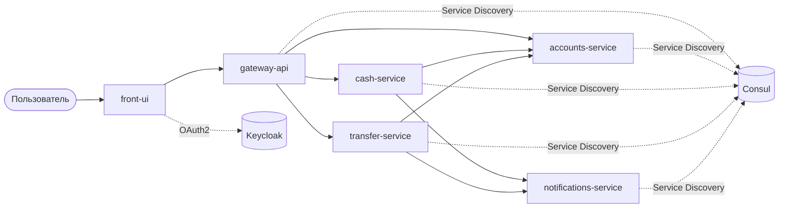
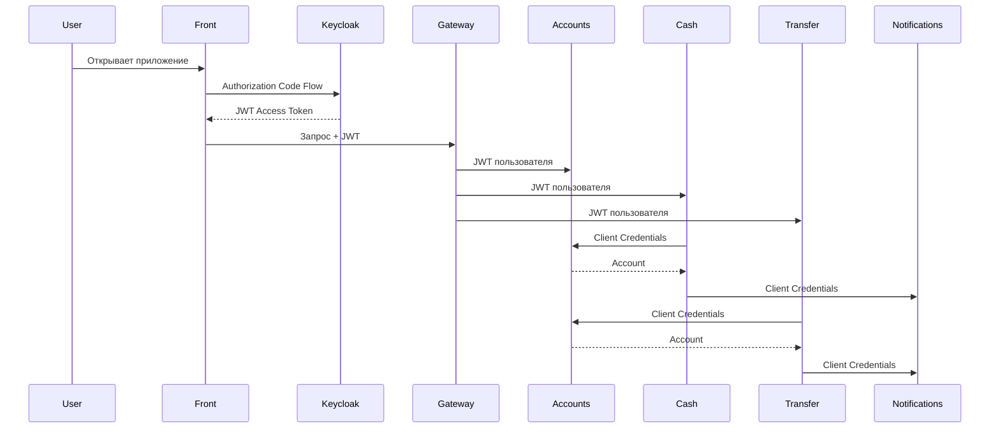
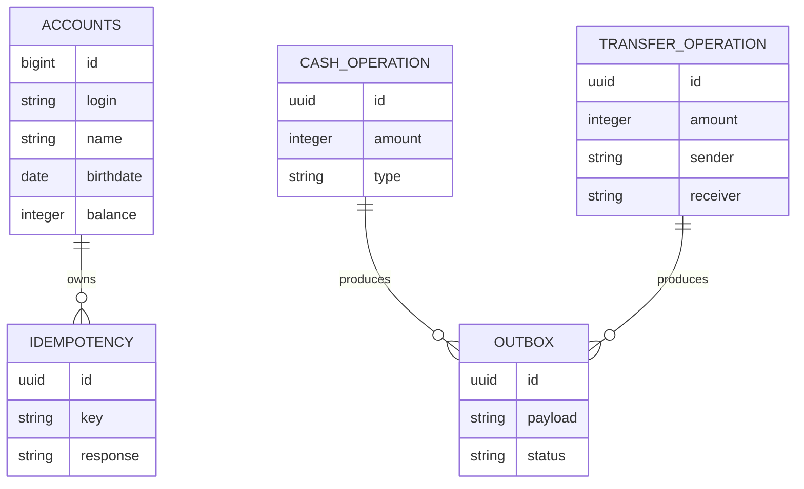

# my-bank-app

Мультимодульное микросервисное приложение **«Банк»** на Spring Boot с использованием паттернов микросервисной архитектуры.

## Структура проекта

| Подпроект | Описание |
|-----------|----------|
| `front-ui` | Веб-интерфейс банка (Thymeleaf) |
| `gateway-api` | API Gateway (Spring Cloud Gateway) |
| `accounts-service` | Управление аккаунтами и балансами |
| `cash-service` | Пополнение и снятие средств |
| `transfer-service` | Переводы между счетами |
| `notifications-service` | Уведомления о банковских операциях |

---

# Архитектура



---

# Потоки авторизации



---

# Технологии

- Java 21
- Spring Boot 3.4
- Spring MVC
- Spring Data JPA
- PostgreSQL
- Spring Cloud Gateway
- Spring Cloud Consul
- Spring Security
- OAuth2 Client
- OAuth2 Resource Server
- Keycloak
- Liquibase
- Testcontainers
- Spring Cloud Contract
- Docker
- Maven
- Lombok

---

# Функциональность

## front-ui

- Авторизация через Keycloak
- Просмотр аккаунта
- Пополнение счёта
- Снятие средств
- Перевод между счетами

## gateway-api

- Единая точка входа
- Маршрутизация запросов
- Передача JWT в микросервисы

## accounts-service

- Хранение пользователей
- Баланс
- Автоматическое создание аккаунта
- Идемпотентное изменение баланса

## cash-service

- Пополнение
- Снятие средств
- Проверка баланса
- Saga Pattern
- Outbox Pattern
- Отправка уведомлений

## transfer-service

- Переводы между пользователями
- Проверка самоперевода
- Saga Pattern
- Компенсация ошибок
- Отправка уведомлений

## notifications-service

- Получение уведомлений
- Идемпотентная обработка
- Логирование операций

---

# База данных



---

# Запуск инфраструктуры

```bash
docker compose -f docker-compose-local.yml up -d
```

Будут запущены:

- PostgreSQL
- Consul
- Keycloak

---

# Сборка

```bash
mvn clean install
```

---

# Запуск сервисов

```bash
mvn -pl gateway-api spring-boot:run

mvn -pl accounts-service spring-boot:run

mvn -pl cash-service spring-boot:run

mvn -pl transfer-service spring-boot:run

mvn -pl notifications-service spring-boot:run

mvn -pl front-ui spring-boot:run
```

---

# Docker

```bash
docker compose up --build
```

---

# Доступ

| Сервис | URL |
|---------|-----|
| Front UI | http://localhost:8080 |
| Gateway | http://localhost:8081 |
| Keycloak | http://localhost:8082 |
| Consul | http://localhost:8500 |

---

# Тестирование

Все тесты

```bash
mvn test
```

Отдельный сервис

```bash
mvn -pl accounts-service test
mvn -pl cash-service test
mvn -pl transfer-service test
mvn -pl notifications-service test
mvn -pl front-ui test
```

---

# Типы тестов

| Тип | Описание |
|------|----------|
| Unit | Mockito + JUnit 5 |
| Integration | Testcontainers + MockMvc |
| Contract | Spring Cloud Contract |

---

# Используемые паттерны

| Паттерн | Реализация |
|----------|------------|
| API Gateway | Spring Cloud Gateway |
| Service Discovery | Consul |
| Saga Pattern | cash-service, transfer-service |
| Outbox Pattern | cash-service, transfer-service |
| Idempotency | accounts-service, notifications-service |
| OAuth2 / JWT | Keycloak |
| Database per Service | PostgreSQL (разделение по схемам) |

---

# Keycloak

Импортируется готовый realm **bank-realm**.

Клиенты:

- front-ui
- accounts-service
- cash-service
- transfer-service
- notifications-service

Роли:

- user
- accounts
- cash
- transfer
- notifications

Создание пользователя:

1. Открыть http://localhost:8082/admin
2. Войти **admin/admin**
3. Realm **bank-realm**
4. Users → Add User
5. Назначить роль **user**